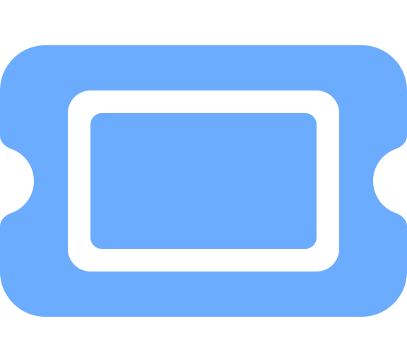

<h1>
    &nbsp;
    Theatre
</h1>


<a href="https://godotengine.org/"></a>
<a href="https://github.com/nndda/Theatre/actions/workflows/dialogue-test.yml"></a>
<a href="https://nndda.github.io/Theatre/"></a>

Yet another <sub>(linear)</sub> dialogue system<b>/</b>addon<b>/</b>plugin for Godot. With features such as:

- ✍️ Text-based, human-readable syntax.
- ⚡ Simple setup. Get started in just <b>7 lines</b> of codes!
- 😐 ....
- 📝 And <b>100%</b> written in <b>GDScript!</b>

<table align="center">
<tr align="center">
<td>
    <b> Rendered </b>
</td>
<td>
    <b> Written </b>
</td>
</tr>
<tr>
<td>


</td>
<td>


</td>
</tr>
</table>

```gdscript
# Load your epic dialogue!
var dialogue: Dialogue = load('res://dialogue.dlg')
# Set up the stage
@export var stage: TheatreStage

func _ready():
    # Start your dialogue
    stage.start(dialogue)

func _input(event):
    # When the space/enter key is pressed,
    if event.is_action_pressed('ui_accept'):
        # Progress your dialogue
        stage.progress()
```

<br>

> [!IMPORTANT]
> This project is still in development and is subject to frequent breaking changes, and bugs. Check out the [Issues](https://github.com/nndda/Theatre/issues) page for known bugs &amp; issues, and [Common Troubleshooting](https://nndda.github.io/Theatre/tutorials/troubleshooting/) documentation page if you encounter any issues.

<br>

# Installation
Run the command below in your Godot project directory. Or [download and install](https://theatre.nnda.dev/installation/) it manually.
```sh
curl -L 'https://nnda.dev/theatre/latest' | tar zxv --strip-components=1
```
The URL above is just a redirect to the `main` branch tarball :p

<br>

# Features

## Variables & Expressions

Insert static...
```yaml
Dia:
    "Let's meet {player}. Don't keep {player_pronoun} waiting."
```
...or dynamic variables.
```yaml
Dia:
    "Good {Game.day_state}, {Game.player.name}."
```

Execute, evaluate, and insert any valid GDScript expressions to the dialogue.
```yaml
Ritsu:
    "HEY {( Player.name.to_upper() )}!!"
```
```yaml
Dia:
    "Your operating system is {( OS.get_name() )}.
    It is currently {( Time.get_time_string_from_system(false) )}."
```

## Dialogue Tags

Fine-tune your dialogue flow with `{delay}` and `{speed}`.
```yaml
Godette:
    "Hello!{delay = 0.7} Nice to meet you."
```
```yaml
Ritsu:
    "{speed = 1.5}AAAAAAAAAAAAAAAAA!!!!"
```

## Manipulate Properties

Manipulate in-game object properties &amp; variables.
```yaml
Ritsu:
    UI.portrait.current = "ritsu_smile.png"
    "Cheers!"
```
```yaml
Ritsu:
    Global.friendship_lv += 1
    "Yay!"
```

## Call Functions

Connect your story to the game with function calls.
```yaml
{player}:
    Player.heal(20)
    "Thanks! That feels so much better."
```

<br>

Call functions or set properties/variables at specific points in the Dialogue.
```yaml
Dia:
    "Let's brighten up the room a little...{d = 1.1}
        Background.set_brightness(1.0)
# or
        Background.brightness = 1.0
    there we go."
```

## Extensible API
Here's some signals, here's some dialogue data, do whatever you want.

```gdscript
func _progressed_on(dialogue_data):
    var speaker = dialogue_data[Dialogue.ACTOR]
    var text = dialogue_data[Dialogue.CONTENT]

    if speaker == "Dia":
        portrait.change("dia.png")
        dialogue_label.text_color = Color.LIGHT_BLUE
    elif speaker == "Ritsu":
        portrait.change("ritsu.png")
        dialogue_label.text_color = Color.PINK
    else:
        portrait.change("blank.png")
        dialogue_label.text_color = Color.WHITE

    history_log.push({
        "speaker": speaker,
        "text": text
    })
```

<p align="center">
<a href="https://nndda.github.io/Theatre/class/dialogue/syntax/">📚 More comprehensive Dialogue features documented here.</a>
</p>

# _(Very)_ Quick Start

Write your epic Dialogue!
```gdscript
# Write it in a *.dlg file, and load it.
var dialogue: Dialogue = load('res://dialogue.dlg')
# or
var dialogue := Dialogue.load('res://dialogue.dlg')

# Write it directly with triple quotation marks.
var dialogue := Dialogue.new("""

Dia:
    "Loading the Dialogue written in a *.dlg file
    is much better for performance."
:
    "It'll keep things clean and efficient."
:
    "Plus, you’ll have syntax highlighting
    for better readability."

""")
```


Set the Stage! Add
<code> TheatreStage</code>
and
<code> DialogueLabel</code>
node to your scene. Structure your scene like the following image:

And adjust the position and size of the
<code> PanelContainer</code>
to your liking.

Select the
<code> TheatreStage</code>
node, and reference the
<code> Label</code>
&
<code> DialogueLabel</code>
node to display your Dialogue. Adjust and configure your
<code> TheatreStage</code>
via the inspector. Alternatively, you can also set them in script:

<br>

<table align="center">
<tr align="center">
<td>
    <b> Inspector </b>
</td>
<td>
    <b> GDScript </b>
</td>
</tr>

<tr>
<td>


</td>
<td>

```gdscript
@onready var stage: TheatreStage = $TheatreStage

func _ready():
    stage.actor_label =\
        $PanelContainer/VBoxContainer/Label
    stage.dialogue_label =\
        $PanelContainer/VBoxContainer/DialogueLabel

```

</td>
</tr>

</table>

Reference the
<code> TheatreStage</code>
node in the script, and set up a way to progress your Dialogue with `TheatreStage.progress()`.

```gdscript
func _input(event):
    if event.is_action_pressed('ui_accept'):
        stage.progress()
```

And finally, start the
<code> TheatreStage</code>
with your `dialogue`.

```gdscript
func _ready():
    stage.start(dialogue)
```

<p align="center">
<a href="https://nndda.github.io/Theatre/quickstart/">📚 More detailed quick start tutorial here.</a>
</p>

## License

- Theatre is licensed under [MIT](LICENSE).
- [Theatre logo](/addons/Theatre/assets/icons/Theatre.svg), created by [nnda](https://github.com/nndda), is licensed under [CC-BY 4.0](https://creativecommons.org/licenses/by/4.0/).
- [Class icons](addons/Theatre/assets/icons/classes) from [@fontawesome](https://fontawesome.com) (recolored), are licensed under [CC-BY 4.0](https://creativecommons.org/licenses/by/4.0/).
