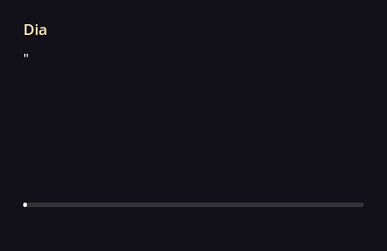

<p class="hidden">
<link rel="stylesheet" href="assets/stylesheets/home.css">
</p>

<!-- Should've use HTML shouldn't I? -->

<div class="home-header" markdown>


<div class="right-col" markdown>

<h1 class="home-title">
Theatre
</h1>

<p style="margin: 0;">
Yet another Godot dialogue addon.
</p>

<p markdown>

[:material-download: v0.8.0](https://github.com/nndda/Theatre/archive/refs/tags/0.8.0.zip "Download Theatre."){ .label }

[:simple-godotengine: Godot 4.3](https://godotengine.org/ "Compatible with Godot 4.3 or above."){ .label }

[:material-book-open-variant: Quick Start](quickstart.md "Get started with Theatre."){ .label }

</p>

</div>

</div>


<div class="container" markdown>

<div class="grid card" markdown>

<div class="preview-img-container" markdown>

{ .preview-img }

<div></div>

</div>

``` { .plain .no-copy }

Dia:
    "Welcome! {d=0.8}to the
    [fx1]Theatre[/fx1]!
        d=0.9
    yet another text-based dialogue addon
        d=0.3
    developed for Godot {gd_ver}."


    ＼(^ ▽ ^)

```

</div>

<br>

<p style="text-align: center;">
    <mark>Comprehensive documentation for class references (properties, methods, signals) are accessible in Godot directly.</mark> Press <kbd>F1</kbd> and search for Theatre classes, or hold <kbd>Ctrl</kbd> and click one of the class in the script to see its documentation page. <del>I'm too lazy to migrate all of that stuff here</del> this site is focused for in-depth tutorials and guides.
</p>

<br>
<br>

!!! warning
    Theatre and this documentation is still under development.
    The contents of this documentation are subject to breaking changes,
    and might not fully reflect the current Theatre version.

</div>

<!-- </div> -->