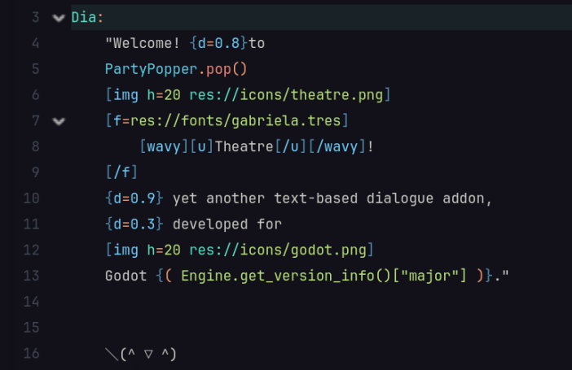

<p class="hidden">
<link rel="stylesheet" href="assets/stylesheets/home.css">
</p>

<!-- Should've use HTML shouldn't I? -->

<div class="home-header" markdown>


<div class="right-col" markdown>

<h1 class="home-title">
Theatre
</h1>

<p style="margin: 0;">
Yet another Godot dialogue addon.
</p>

<p markdown>

[:material-download: v0.12.0](https://github.com/nndda/Theatre/archive/refs/tags/0.12.0.zip "Download Theatre."){ .label }

[:simple-godotengine: Godot 4.5](https://godotengine.org/ "Compatible with Godot 4.5 or above."){ .label }

[:material-book-open-variant: Quick Start](quickstart.md "Get started with Theatre."){ .label }

</p>

</div>

</div>


<div class="container" markdown>

<div class="grid card" markdown>

<div class="preview-img-container" markdown>

{ .preview-img }

</div>

<div class="preview-img-container" markdown>

{ .preview-img }

</div>

</div>

</div>

<br>

<section markdown>

## Install Theatre <small class="label">Latest</small> { .install-home-heading }

```sh { .install-sh-home }
curl -L 'https://nnda.dev/theatre/latest' | tar zxv --strip-components=1
```

<p align="center" markdown>
Run the command above in your Godot project directory.
Or [download and install](installation.md) it manually.
</p>

</section>

<br>

<hr>

<br>

<section class="grid cards features" markdown>

-   :material-clock-fast:{ .lg .middle } **Simple Setup**

    ---

    Install easily with a single [command line](#install-theatre-latest).
    And start writing & running your first dialogue in just 7 lines of codes!

    <div class="flex-space"></div>

    [:fontawesome-solid-arrow-right: Quick Start](quickstart.md)

    [:fontawesome-solid-arrow-right: Tutorials](tutorials/index.md)


-   :material-pen:{ .lg .middle } **Human-readable Syntax**

    ---

    Write your [Dialogue] easily and quickly, with syntax designed for clarity and simplicity. Complete with its own syntax highlighting.

    <div class="flex-space"></div>

    [:fontawesome-solid-arrow-right: Dialogue Syntax](class/dialogue/syntax.md)


-   :material-arrow-expand:{ .lg .middle } **Full Control**

    ---

    Control _your_ story with _your_ own way using [`progress()`](#). Interact with in-game functionalities effortlessly with [function calls](#) and [expression tag](#).

    <div class="flex-space"></div>

    [:fontawesome-solid-arrow-right: `TheatreStage` Class Reference](class/theatrestage/references/index.md)

</section>

<br>

## :fontawesome-solid-heart: Support the Project { .install-home-heading }

<p align="center" markdown class="support-links">
[:simple-liberapay: Liberapay](https://liberapay.com/nnda){ .liberapay }
&nbsp;
•
&nbsp;
[:simple-kofi: Ko-fi](https://ko-fi.com/nnda){ .kofi }
&nbsp;
•
&nbsp;
[:simple-patreon: Patreon](https://patreon.com/nnda){ .patreon }
</p>

<!-- 
<p style="text-align: center;">
    <mark>Comprehensive documentation for class references (properties, methods, signals) are accessible in Godot directly.</mark> Press <kbd>F1</kbd> and search for Theatre classes, or hold <kbd>Ctrl</kbd> and click one of the class in the script to see its documentation page. <del>I'm too lazy to migrate all of that stuff here</del> this site is focused for in-depth tutorials and guides.
</p>
 -->
 
<br>
<br>
<br>


<div class="container" markdown>

!!! warning
    Theatre and this documentation is still under development.
    The contents of this documentation are subject to breaking changes,
    and might not fully reflect the current Theatre version.

</div>
