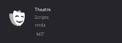

# Installation

## Installing

For the most up-to-date features and fixes, **download the addon directly from the official GitHub repository.** The GitHub release will always be the latest version, as updates are available immediately, whereas updates from the Godot Asset Library may take a few additional days due to the approval process.

!!! note
    The built-in update checks also look for the latest GitHub release.

### via official releases

Grab the latest release [:material-download: here](https://github.com/nndda/Theatre/archive/refs/tags/0.10.0.zip), or get it from:

- [:simple-godotengine: Godot Asset Library](https://godotengine.org/asset-library/asset/2332)
- [:simple-github: GitHub](https://github.com/nndda/Theatre/releases)

#### Manually

0. Extract the downloaded zip file, move the content inside `addons/` folder to your project's `addons/` folder.

#### In-editor

0. Go to the `AssetLib` scene tab.

0. Click `Import...` on the top right corner.

0. Select the downloaded zip file.

0. Make sure `Ignore asset root` is checked, and then click `Install`.

### via Godot Asset Library

0. Go to the `AssetLib` scene tab.

0. Search for `"Theatre"`.

    { width="320" }

0. Click `Download`, and wait for the download to finish.

0. Make sure `Ignore asset root` is checked, and then click `Install`.


## Enabling

Make sure that Theatre is enabled at `Project > Project Settings... > Plugins`.

You should see the following on your console output.

```
🎭 Theatre <version> by nnda
```


## Updating

0. Disable Theatre plugin and close your project.

0. Delete `addons/Theatre/` folder.

0. Re-install it [via official releases manually](#manually).

0. Enable the Theatre plugin.

!!! note
    For updates on `Dialogue` (new `Dialogue` features, syntax, or parser updates), you might want to re-import the written `Dialogue` resources, by using `Project > Tools > 🎭 Theatre > ♻️ Reimport Dialogue resources`.