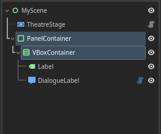
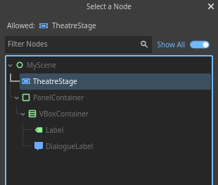

# Quick Start

You've installed the plugin [(or have you?)](installation.md "Installing the plugin."). You had the characters, plot, and the worldbuilding of your story ready, or maybe not, thats ok too.
Lets start by writing a `Dialogue`.

## Writing the Dialogue

Create a new text file in your project. And write your dialogue with the following syntax:

```
Actor's name:
    "The Dialogue syntax are designed to be human readable,
    similar other data formats like YAML."

Actor's name:
    "You just need the character or actor's name,
    with `:` at the end."

Actor's name:
    "And the dialogue body indented."

Actor's name:
    The quotation marks are also entirely optional,
    everything you wrote is displayed as is.

```

Save it as `*.dlg` file. Here we'll save the file as `res://intro.dlg`. Now that the `Dialogue` is ready, let's set up the `Stage`.

[**More on writing Dialogue here.**](class/dialogue/syntax.md){ .md-button }

## Setting up the Stage

### Nodes & UI

Create a new `2D` or `User Interface` scene. We'll use `User Interface` scene, which use `Control` node for the scene's root. And add the following nodes: `Stage`, `Label`, and `DialogueLabel`.

<div class="grid cards" markdown>

- { .center }

</div>

To tidy things up a little, add `PanelContainer`, and `VBoxContainer` inside it. Put the `Label` and `DialogueLabel` inside the `VBoxContainer`.

<div class="grid cards" markdown>

- { .center }

</div>

Adjust the size and position of the `PanelContainer` to your liking.

And lastly, make sure that `fit_content` is set to `true` on `DialogueLabel`.

<div class="grid cards" markdown>

- { .center }

</div>

### Script

Attach a script to the scene's root.

```gdscript
extends Control
```

Create a variable with `@export` annotation to reference the `Stage` node made previously. In this example, we'll name the variable `'my_stage'`.

```gdscript hl_lines="3"
extends Control

@export var my_stage : Stage
```

Click the scene's root node, go to the inspector, and assign the `Stage` node to `my_stage`.

<div class="grid cards" markdown>

- { .center }

- { .center }

</div>

Click the `Stage` node, and head over to the inspector dock. Reference the `Label` and `DialogueLabel` node that were made before.

<div class="grid cards" markdown>

- { .center }

</div>

[**More on configuring Stage here.**](class/stage/configuration.md){ .md-button }

## Controlling the Stage

### Starting

Create another variable to store the `Dialogue`, we'll name it `'epic_dialogue'`. Use `Dialogue.load()` and pass the path of the written dialogue file.

```gdscript hl_lines="3"
extends Control

var epic_dialogue = Dialogue.load('res://intro.dlg')

@export var my_stage : Stage
```

Call `start()` method on `my_stage`, and pass the `epic_dialogue` as the argument to start it.

```gdscript hl_lines="7 8"
extends Control

var epic_dialogue = Dialogue.load('res://intro.dlg')

@export var my_stage : Stage

func _ready():
    my_stage.start(epic_dialogue)
```

Now the `Dialogue` will start when you play the scene. But we're not done here yet!

### Progressing

Progress the `Dialogue` with `progress()`. In this example, we'll use `_input(event)` with Godot's default action key `'ui_accept'` (space/enter key).

```gdscript hl_lines="10 11 12"
extends Control

var epic_dialogue = Dialogue.load('res://intro.dlg')

@export var my_stage : Stage

func _ready():
    my_stage.start(epic_dialogue)

func _input(event):
    if event.is_action_pressed('ui_accept'):
        my_stage.progress()
```

Now, everytime `'ui_accept'` key is pressed, the Dialogue should progress.

## Summary

And, thats it!

Here is how the scene and script should looks like:

```
MyScene
  ├─ Stage
  └─ PanelContainer
        └─ VBoxContainer
            ├─ Label
            └─ DialogueLabel
```

```gdscript
extends Control

var epic_dialogue = Dialogue.load('res://intro.dlg')

@export var my_stage : Stage

func _ready():
    my_stage.start(epic_dialogue)

func _input(event):
    if event.is_action_pressed('ui_accept'):
        my_stage.progress()
```

There's also the [Minimal Theatre Setup](tutorials/minimal_setup/index.md) tutorial which is very similar to this article, but a lot more shorter and straightforward.

## Next step

* More about writing your `Dialogue` on [Dialogue Syntax](class/dialogue/syntax.md).
* Configure your `Stage` on [Configuring Stage](class/stage/configuration.md).
* Encounter any problems? Check out [Common Troubleshooting](tutorials/troubleshooting.md).

### Specific tutorials

* [Toggling Dialogue UI](tutorials/dialogue_ui_toggle/index.md)
* [Adding Dialogue Beep SFX](tutorials/dialogue_beep/index.md)