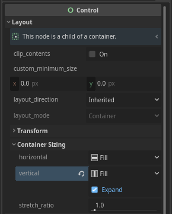

# Continue Indicator

```
Dia:
    "Here, we'll create a little 'Press-to-continue' indicator
    when the dialogue line has finished rendering."
:
    "This small touch helps with player's pacing, and reduces accidental skips."
:
    "The player will know if the dialogue line has finished,
      delay=3
    or if there's more to see."
```

!!! info "TL;DR"
    Create a [Label] node, prompting the player to continue the dialogue.<br>
    On the [DialogueLabel]'s [`text_rendered`](/class/dialoguelabel/references/#text_rendered) signal, hide said [Label] node.<br>
    And on the [TheatreStage]'s [`progressed`](/class/theatrestage/references/#progressed) signal, show the [Label] node.


0. Create a [Label] node. We'll name it `ContinueIndicator`.

    ``` hl_lines="7"
    MyScene
      ├─ TheatreStage
      └─ PanelContainer
            └─ VBoxContainer
                ├─ Label
                ├─ DialogueLabel
                └─ ContinueIndicator
    ```

    And set the `text` as a simple `"Press space/enter to continue"`. Since we are progressing the dialogue via the built-in `'ui_accept'` input event, which is the <kbd>space</kbd> or <kbd>enter</kbd> key.

    <br>

0. Reference the [Label] node as `continue_indicator` in the script.

    ```gdscript hl_lines="1"
    @export var continue_indicator: Label
    ```

    <br>

0. Connect the [`text_rendered`](/class/dialoguelabel/references/#text_rendered) signal of the [DialogueLabel], to the method `_on_dialogue_label_text_rendered()`.

    ```gdscript hl_lines="1-2"
    func _on_dialogue_label_text_rendered():
        pass # Replace with function body.
    ```

    In this method, we'll call [`show()`](https://docs.godotengine.org/en/4.4/classes/class_canvasitem.html#class-canvasitem-method-show) on our `continue_indicator`.

    ```gdscript hl_lines="2"
    func _on_dialogue_label_text_rendered():
        continue_indicator.show()
    ```

    <br>

0. Connect the [`progressed`](/class/theatrestage/references/#progressed) signal of the [TheatreStage], to the method `_on_theatre_stage_progressed()`.

    ```gdscript hl_lines="1-2"
    func _on_theatre_stage_progressed():
        pass # Replace with function body.
    ```

    Here, we'll call [`hide()`](https://docs.godotengine.org/en/4.4/classes/class_canvasitem.html#class-canvasitem-method-hide) on our `continue_indicator`.

    ```gdscript hl_lines="2"
    func _on_theatre_stage_progressed():
        continue_indicator.hide()
    ```

0. We are actually done by this point. But, to tidy things up a little, lets add a [Control] node, right in-between our `DialogueLabel` and `ContinueIndicator` node. And lets name it `Space`.

    ``` hl_lines="7"
    MyScene
      ├─ TheatreStage
      └─ PanelContainer
            └─ VBoxContainer
                ├─ Label
                ├─ DialogueLabel
                ├─ Space
                └─ ContinueIndicator
    ```

    Set its vertical container sizing to `Fill`, and tick the `Expand` checkbox.

    <div class="grid cards" markdown>

    - { .center }

    </div>

    This will 'push down' the press-to-continue label, so that it 'sticks' to the bottom of the container.

    <br>

## Code Summary

``` hl_lines="7-8"
MyScene
  ├─ TheatreStage
  └─ PanelContainer
        └─ VBoxContainer
            ├─ Label
            ├─ DialogueLabel
            ├─ Space
            └─ ContinueIndicator
```

```gdscript hl_lines="6 15-16 18-19"
extends Control

var dlg: Dialogue # Load/create Dialogue here

@export var my_stage: TheatreStage
@export var continue_indicator: Label

func _input(event):
    if event.is_action_pressed("ui_accept"):
        my_stage.progress()

func _ready():
    my_stage.start(dlg)

func _on_dialogue_label_text_rendered():
    continue_indicator.show()

func _on_theatre_stage_progressed():
    continue_indicator.hide()
```

<br>

Got any questions? feel free to ask them in the [GitHub Discussions!](https://github.com/nndda/Theatre/discussions/new?category=help){ target="_blank" }
