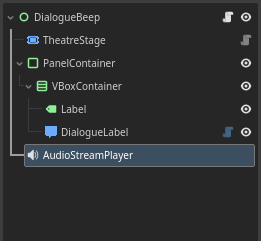
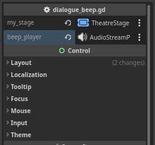

# Adding Dialogue Beep SFX

```
Dia:
    "Dialogue voice beep often used as
    substitute for voice acting in video games."
:
    "Especially in the older titles
    and smaller budget productions."
:
    "Although not really used in modern titles anymore,
    there's many indie games that still use this today."

```

!!! info "TL;DR"
    Play the dialogue beep audio with the `DialogueLabel`'s `character_drawn` signal.

0. Add the dialogue voice beep audio file to your project. In this article, we'll use one of the sound effect from [Text/Dialogue Bleeps Pack by dmochas :fontawesome-brands-creative-commons: :fontawesome-brands-creative-commons-by:](https://dmochas-assets.itch.io/dmochas-bleeps-pack).

    <br>

0. Add `AudioStreamPlayer` node, attach the beep audio file to it, and reference it as `beep_player` variable.

    ```gdscript
    @export var beep_player : AudioStreamPlayer
    ```

    <div class="grid cards" markdown>

    - { .center }

    - { .center }

    </div>

    <br>

0. Connect the signal `character_drawn` from `DialogueLabel` to method `_on_dialogue_label_character_drawn()`.

    ```gdscript
    func _on_dialogue_label_character_drawn():
        pass # Replace with function body.
    ```

    <div class="grid cards" markdown>

    - { .center }

    </div>

    <br>

0. On the signal method, play the audio from the `beep_player` using `play()`. Only if its not already playing.

    ```gdscript hl_lines="2 3"
    func _on_dialogue_label_character_drawn():
        if not beep_player.playing:
            beep_player.play()
    ```

    <br>

## Code summary

``` hl_lines="7"
MyScene
  ├─ Stage
  ├─ PanelContainer
  │     └─ VBoxContainer
  │         ├─ Label
  │         └─ DialogueLabel
  └─ AudioStreamPlayer
```

```gdscript hl_lines="6 15 16 17"
extends Control

var dlg : Dialogue # Load/create Dialogue here

@export var stage : Stage
@export var beep_player : AudioStreamPlayer

func _input(event):
    if event.is_action_pressed("ui_accept"):
        stage.progress()

func _ready():
    stage.start(dlg)

func _on_dialogue_label_character_drawn():
    if not beep_player.playing:
        beep_player.play()
```

<br>

## Download

[Download scene & script](tutorial-dialogue_beep.zip "Drop the directory 'tutorials' directly in your project root folder"){ .md-button download="tutorial-dialogue_beep.zip" }

Got any questions? feel free to ask them in the [GitHub Discussions!](https://github.com/nndda/Theatre/discussions/new?category=help){ target="_blank" }