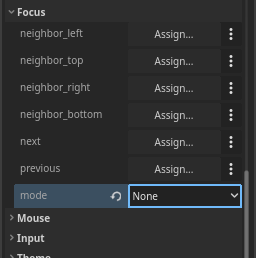

# Toggling Dialogue UI

```
Dia:
    "Having the Dialogue UI visible at all time
    is probably not very ideal."
:
    "Unless you're making a full on text adventure game,
    you'd want to show the dialogue UI only when it needed to."
:
    "Here, we'll demonstrate how you can do that, with just a simple
    `show` and `hide` CanvasItem methods."


```

!!! info "TL;DR"
    Utilize `Stage`'s signals: `started`, `finished`, and `cancelled` to call `hide()`/`show()` methods on the dialogue UI.

Before we begin, let's add a 'start dialogue' button, so we don't have to restart the scene everytime the dialogue ended.

0. Add a `Button`, and we'll rename it to `StartButton`. Adjust its text, size, and position to your liking.

0. Set the `focus_mode` properto to none. To avoid accidental button press when progressing the dialogue.

    <div class="grid cards" markdown>

    - { .center }

    </div>

0. Connect the `pressed` signal of the button to a method. In that method, call the `Stage`'s `start()` method. It should looks something like this:

    ```gdscript
    func _on_start_button_pressed():
        stage.start(dlg)
    ```

    Now, let's move on to the tutorial.

<hr>

0. Let's take a look at the current scene tree. Since `PanelContainer` is the parent of all UI dialogue, let's save it as a variable named `dialogue_container`.

    ```gdscript
    @export var dialogue_container : PanelContainer
    ```

    !!! note
        Don't forget to assign the node in the inspector when using `@export` annotation to reference nodes!

    <br>

0. Create 2 methods: `hide_dialogue_ui()` and `show_dialogue_ui()`.

    ```gdscript
    func show_dialogue_ui():
        pass

    func hide_dialogue_ui():
        pass
    ```

    <br>

0. For now, let's just simply show and hide the dialogue UI, by calling `show()` and `hide()` on `dialogue_container`.

    ```gdscript hl_lines="2 5"
    func show_dialogue_ui():
        dialogue_container.show()

    func hide_dialogue_ui():
        dialogue_container.hide()
    ```

    <br>

0. Click your `Stage` node, head over to the `Node`'s Signals dock, and connect the signals `started`, `finished`, and `cancelled` to the 2 methods created previously. More specifically:

    <style>.md-typeset__scrollwrap{ text-align: center; }</style>

    | Signals                    | Method               |
    |----------------------------|----------------------|
    | `started`                  | `show_dialogue_ui()` |
    | `finished`, `cancelled`    | `hide_dialogue_ui()` |

    <div class="grid cards" markdown>

    - { .center }

    </div>

    <br>

## Code summary

``` hl_lines="7"
MyScene
  ├─ Stage
  ├─ PanelContainer
  │     └─ VBoxContainer
  │         ├─ Label
  │         └─ DialogueLabel
  └─ StartButton
```

```gdscript hl_lines="6 15 16 18 19 21 22"
extends Control

var dlg : Dialogue # Load/create Dialogue here

@export var stage : Stage
@export var dialogue_container : PanelContainer

func _input(event):
    if event.is_action_pressed("ui_accept"):
        stage.progress()

func _ready():
    stage.start(dlg)

func _on_start_button_pressed():
    stage.start(dlg)

func show_dialogue_ui():
    dialogue_container.show()

func hide_dialogue_ui():
    dialogue_container.hide()

```

<br>

## Download

[Download scene & script](tutorial-dialogue_beep.zip "Drop the directory 'tutorials' directly in your project root folder"){ .md-button download="tutorial-dialogue_beep.zip" }

Got any questions? feel free to ask them in the [GitHub Discussions!](https://github.com/nndda/Theatre/discussions/new?category=help){ target="_blank" }