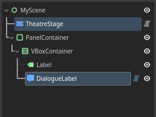

# Minimal Theatre Setup

This article cover the basic minimal setup for Theatre, like the one created in the [Quick Start](../../quickstart.md) article, but a lot more shorter and straightforward.

<hr>

1. Create a new `2D` or `User Interface` scene, and structure it like the following:

    <div class="grid cards" markdown>

    - { .center }

    </div>

    The two highlighted nodes are the Theatre-specific nodes.

    Adjust the size and position of the `PanelContainer` to your liking.

    <br>

2. Tick the `fit_content` property on the `DialogueLabel`.

    <div class="grid cards" markdown>

    - { .center }

    </div>

    <br>

3. Attach a script to the scene and create a new `Stage` variable with `@export`.

    ```gdscript hl_lines="3"
    extends Control

    @export var stage : Stage

    ```

    <br>

4. Go to the inspector, and assign the `Stage` node to `stage`.

    <div class="grid cards" markdown>

    - { .center }

    - { .center }

    </div>

    <br>

5. Click the `Stage` node, go to the inspector, and assign the `Label` to `actor_label`, and `DialogueLabel` to `dialogue_label`.

    <div class="grid cards" markdown>

    - { .center }

    </div>

    <br>

6. Use input event to progress the `Stage`.

    ```gdscript hl_lines="5 6 7"
    extends Control

    @export var stage : Stage

    func _input(event):
        if event.is_action_pressed("ui_accept"):
            stage.progress()
    ```

    <br>

7. You can then write/load your `Dialogue`, and start it.

    ```gdscript hl_lines="3 11 12"
    extends Control

    var dlg : Dialogue # Load/create Dialogue here

    @export var stage : Stage

    func _input(event):
        if event.is_action_pressed("ui_accept"):
            stage.progress()

    func _ready():
        stage.start(dlg)
    ```

   <br>

## Code summary

```
MyScene
  ├─ Stage
  └─ PanelContainer
        └─ VBoxContainer
            ├─ Label
            └─ DialogueLabel
```

```gdscript
extends Control

var dlg : Dialogue # Load/create Dialogue here

@export var stage : Stage

func _input(event):
    if event.is_action_pressed("ui_accept"):
        stage.progress()

func _ready():
    stage.start(dlg)
```

<br>

## Download

[Download scene & script](tutorial-minimal_setup.zip "Drop the directory 'tutorials' directly in your project root folder"){ .md-button download="tutorial-minimal_setup.zip" }

Got any questions? feel free to ask them in the [GitHub Discussions!](https://github.com/nndda/Theatre/discussions/new?category=help){ target="_blank" }